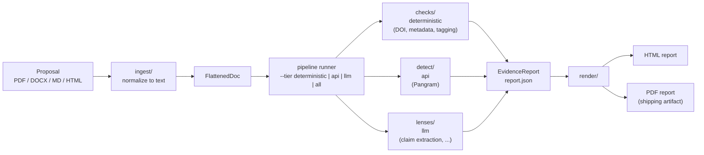

# SlopChecker

An open-source utility for funding orgs to screen incoming proposals for
AI-generation signals, citation integrity, solicitation compliance, and
tagging. It reports evidence for a human reviewer — it never auto-rejects
anything.

Built by a five-person team at [Hacking the Think Tank](https://hackingthethinktank.com/)
(2026-07-31). Live demo: **[slop-checker.com](https://slop-checker.com)**.

## Quickstart

```bash
git clone https://github.com/nawagner/SlopChecker.git
cd SlopChecker
pip install -e ".[dev,pdf,docx]"
cp .env.example .env          # optional — every key is optional, see below
slopcheck run harness/fixtures/proposal_climate.md --tier deterministic
```

That runs the checks that need no API keys and no network, and writes
`slopcheck-reports/proposal_climate.report.json` (+ `.html` if you add
`--format json,html`). Add `--tier all` once you've filled in `.env` to
also run the API/LLM-backed checks.

```bash
slopcheck --help          # commands: run, render, config, version
slopcheck run --help      # --tier, --only/--skip, --format, --dry-run, --batch
slopcheck config          # shows which API keys are set, without printing them
```

`slopcheck render report.json --pdf` turns a `report.json` into the
paginated PDF evidence report — the actual shipping artifact; HTML is the
design-fidelity preview.

## API keys

Every key in `.env.example` is optional. A check whose key is missing
reports `skipped: missing <VAR>` instead of crashing the run — see
`slopcheck config` to check what's set.

## Data handling

Submissions are often unpublished and contain applicant data. What leaves your
machine, to whom, and what is retained is documented in
[PRIVACY.md](PRIVACY.md). Short version: the only checks that send your document
off-machine are the ones you supply keys for (Pangram) or that fetch cited
sources over the network; the whole deterministic tier runs locally.

## How it works



Every check result feeding into `report.json` is `true | false | number`
plus a `skipped`/`errored` status — never free text, never a verdict. See
[`docs/DATA_MODEL.md`](docs/DATA_MODEL.md) for the full contract.

## How it's organized

| Path | What it is |
|---|---|
| `src/slopchecker/pipeline/` | check registry, tiered runner, citation extraction |
| `src/slopchecker/lenses/` | LLM prompt packs (markdown, see [`lenses/README.md`](src/slopchecker/lenses/README.md)) |
| `src/slopchecker/detect/` | AI-detection providers (Pangram) |
| `src/slopchecker/checks/` | deterministic checks: DOI resolution, metadata, tagging |
| `src/slopchecker/report/` | evidence report rendering: HTML + PDF |
| `src/slopchecker/ingest/` | PDF/DOCX/MD/HTML → normalized `FlattenedDoc` |
| `worker/` | Cloudflare Worker: proxy, landing page, D1 report store |
| `harness/` | planted-defect validation, recall scoring |
| `fixtures/`, `tests/fixtures/` | fabricated test documents — never real applicant material (#22) |

`report.json` is the contract between checks and the renderer — see
[`docs/DATA_MODEL.md`](docs/DATA_MODEL.md) for the schema, a worked
example, and how to run the tests. Shared bulk data (corpora, fixtures too
big for git) lives in Cloudflare R2 — see
[`docs/data-storage.md`](docs/data-storage.md) for what's there and how to
get access. Reports can additionally be stored in Cloudflare D1 to make
results queryable across submissions — see
[`docs/d1-database.md`](docs/d1-database.md).

## Contributing

See [`CONTRIBUTING.md`](CONTRIBUTING.md) to get set up, and
[`CLAUDE.md`](CLAUDE.md) for the full set of team conventions (module
ownership, git discipline, design decisions already made).

## Team

Nick Wagner, Dan Parshall, Emerson Brooking, Alex, Dominique Ramsawak —
see `CLAUDE.md` for GitHub handles.
